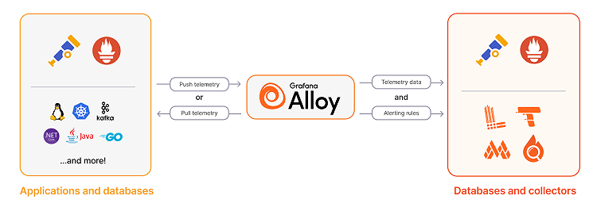

# Grafana Alloy

An open-source modern tool to collect telemetry (metrics, logs, traces), in a unified way by Grafana Labs. It can replace OpenTelemetry Collectors, Promtail (deprecated) and Exporters (node, cadvisor etc).

This simplifies the general architecture much more (although alloy itself is very complicated).



## Configuration

Alloy uses `config.alloy` file for its configuration. This can be split into multiple files (and linked via `import`).

We define **Alloy Components** in the config file. These components form component blocks. There are 3 types of components:

1. Sources (scrape, collect, receive)
2. Processors (filter, relabel, enrich)
3. Exporters/Writers (send to remote systems)

```alloy
// Collection: mount a local directory with a certain path spec
local.file_match "applogs" {
    path_targets = [{"__path__" = "/tmp/app-logs/app.log"}]
}

// Collection: Take the file match as input, and scrape those mounted log files
loki.source.file "local_files" {
    targets    = local.file_match.applogs.targets

    // This specifies which component should process the logs next, the "link in the chain"
    forward_to = [loki.process.add_new_label.receiver]
}

// Transformation: pull some data out of the log message, and turn it into a label
loki.process "add_new_label" {
    stage.logfmt {
        mapping = {
            "extracted_level" = "level",
        }
    }

    // Add the value of "extracted_level" from the extracted map as a "level" label
    stage.labels {
        values = {
            "level" = "extracted_level",
        }
    }

    // The next link in the chain is the local_loki "receiver" (receives the telemetry)
    forward_to = [loki.write.local_loki.receiver]
}

// Anything that comes into this component gets written to the loki remote API
loki.write "local_loki" {
    endpoint {
        url = "http://loki:3100/loki/api/v1/push"
    }
}
```

The Alloy syntax reduces configuration errors by making files easier to read and write. It uses blocks, attributes, and expressions. You can copy and paste blocks from the documentation to get started quickly.

The Alloy syntax is declarative, so the order of components, blocks, and attributes doesn’t matter. The relationships between components determine the pipeline’s operation sequence.

Blocks
Use Blocks to configure components and groups of attributes. Each block can include attributes or nested blocks. Blocks represent steps in the pipeline.

alloy
Copy code to clipboard
Copy
prometheus.remote_write "default" {
  endpoint {
    url = "http://localhost:9009/api/prom/push"
  }
}
The preceding example contains two blocks:

prometheus.remote_write "default": A labeled block that creates a prometheus.remote_write component. The label is the string "default".
endpoint: An unlabeled block inside the component that configures an endpoint for sending metrics. This block sets the url attribute to specify the endpoint.
Attributes
Use Attributes to configure individual settings. Attributes follow the format ATTRIBUTE_NAME = ATTRIBUTE_VALUE.

The following example sets the log_level attribute to "debug".

alloy
Copy code to clipboard
Copy
log_level = "debug"
Expressions
Use expressions to compute attribute values. Simple expressions include constants like "debug", 32, or [1, 2, 3, 4]. The Alloy syntax supports complex expressions, such as:

Referencing component exports: local.file.password_file.content
Mathematical operations: 1 + 2, 3 * 4, (5 * 6) + (7 + 8)
Equality checks: local.file.file_a.content == local.file.file_b.content
Calling functions from the standard library: sys.env("HOME") retrieves the HOME environment variable.
You can use expressions for any attribute in a component definition.

Reference component exports
The most common expression references a component’s exports, such as local.file.password_file.content. You form a reference by combining the component’s name (for example, local.file), label (for example, password_file), and export name (for example, content), separated by periods.

Configuration syntax design goals
Alloy is:

Fast: The configuration language is fast and the controller evaluates changes quickly.
Simple: The configuration language is easy to read and write, reducing the learning curve.
Easy to debug: The configuration language provides detailed error information.
The Alloy configuration syntax is a distinct language with custom syntax and features, such as first-class functions.

Blocks group related settings and typically represent component creation. Blocks have a name consisting of identifiers separated by ., an optional user label, and a body containing attributes and nested blocks.
Attributes appear within blocks and assign values to names.
Expressions represent values, either literally or by referencing and combining other values. You use expressions to compute attribute values.
